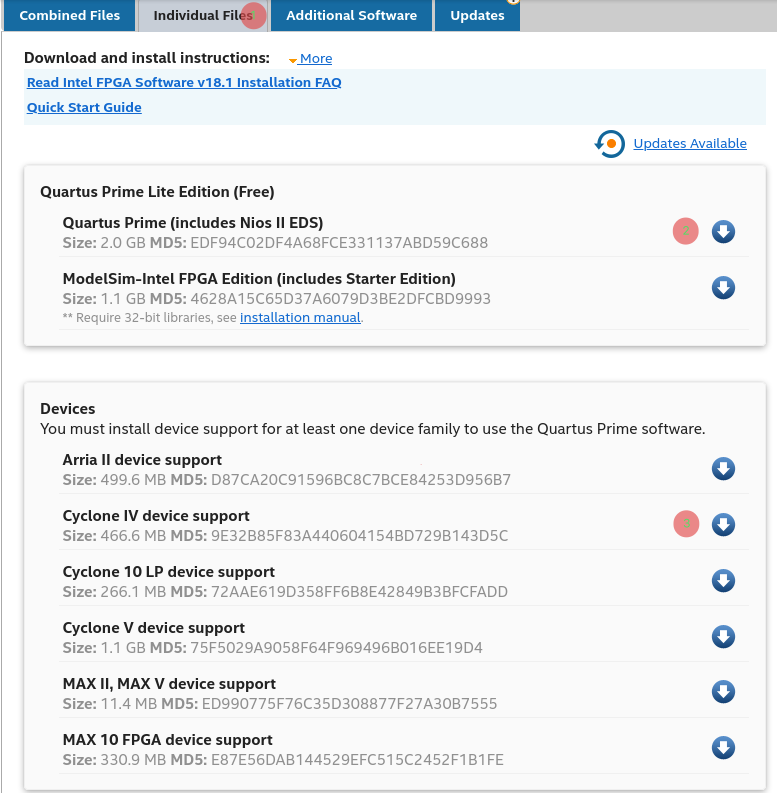

# Intel FPGA tools and quirks
This document briefly describes some of the tools that are part of the Quartus Prime Lite. Also, I have included some troubleshooting tips for common quirks with Intel FPGA's on GNU/Linux that I have encountered during my setup. 

# Installing the Quartus Prime Lite edition
- Intel Quartus Prime Lite edition 18.1 is required if you are using the framework with Intel FPGA.
- Go to Intel's website `https://fpgasoftware.intel.com/18.1/?edition=lite&platform=linux` , and download the Quartus Prime Lite edition 18.1.
  1. Click on Individual Files
  2. Quartus Prime: Click on blue arrow next to number 2 in red circle. Follow on screen instructions.
  3. Cyclone IV device support: Click on blue arrow next to number 3 in red circle. Follow on screen instructions.
  4. Once all the files have been downloaded, run installer from the shell:
    - `chmod +x installer.run`
    - `./installer.run`
  5. By default only root is allowed to use USB Blaster device. You need to copy this file `intelSupport/92-usbblaster.rules` to `/etc/udev`. The command below will do it for you:

     `sudo cp intelSupport/92-usbblaster.rules /etc/udev`

> **_NOTE:_** You will need to make an account before you can preceed with the download.



## Setting up Nios II environment
Nios II tools are not available in you shell unless you run the command bellow. Please note that path to your Quartus instalation might differ if you use later version than 18.1, or if you install to non-default location.
```sh
 $ /opt/18.1/nios2eds/nios2_command_shell.sh 
```

## .bashrc file
For convinience you might want to add the following lines to your ~/.bashrc file

```bashrc
alias Xnios=/opt/18.1/nios2eds/nios2_command_shell.sh
```

```
alias Xbcproj="cd $HOME/de0_nano_quartus_project/software/"
```

When you open a new shell and type in: 
- `Xnios` you will be able to run nios2-* tools in this shell
- `Xbcproj` your current directory will change to `$HOME/de0_nano_quartus_project/software` 

# Nios II environment
Nios II environment consists of several tools used for debugging, compiling, loading the software to dev board. 

## Nios II terminal
Nios II terminal `nios2-terminal` allows you to see stdout from the target device on terminal of your UNIX system. You can redirect output from `nios2-terminal` to a file like this `nios2-terminal > file`. 

## Nios II download
Nios II download (`nios2-download`) handles the loading of your application to the target device. 

## Nios II gdbserver
Nios II gdbserver (`nios2-gdbserver -g`) is a bridge between proprietary Intel JTAG protocol and GDB debugging interface.

# Programming the FPGA
The design can be programmed into the FPGA from the command line with `nios2-configure-sof` command. You need to specify the sof design file as first argument to `nios2-configure-sof`.

```console
ubuntu@ubuntu:~/alias Xbcproj="cd $HOME/de0_nano_quartus_project/software/"
/software/bc_proj_ucos2$ ./program.sh 
Warning (210039): File ./../../DE0_NANO_SDRAM_Nios_Test_time_limited.sof contains one or more time-limited megafunctions that support the Intel FPGA IP Evaluation Mode feature that will not work after the hardware evaluation time expires. Refer to the Messages window for evaluation time details.
Info (210040): SRAM Object File ./../../DE0_NANO_SDRAM_Nios_Test_time_limited.sof contains time-limited megafunction that supports Intel FPGA IP Evaluation Mode feature -- Vendor: 0x6AF7, Product: 0x00A2
Info: *******************************************************************
Info: Running Quartus Prime Programmer
Info: Command: quartus_pgm --no_banner --mode=jtag -o p;./../../DE0_NANO_SDRAM_Nios_Test_time_limited.sof
Info (213045): Using programming cable "USB-Blaster [2-2.2]"
Info (213011): Using programming file ./../../DE0_NANO_SDRAM_Nios_Test_time_limited.sof with checksum 0x003FEA98 for device EP4CE22F17@1
Info (209060): Started Programmer operation at Wed Feb  6 09:07:27 2019
Info (209016): Configuring device index 1
Info (209017): Device 1 contains JTAG ID code 0x020F30DD
Info (209007): Configuration succeeded -- 1 device(s) configured
Info (209011): Successfully performed operation(s)
Info (209061): Ended Programmer operation at Wed Feb  6 09:07:28 2019
Please enter i for info and q to quit:
```
> **_NOTE:_** This shell must be kept open.

# Loading executable to Nios II processor
Now we need to load an executable with ucos and application onto the platform. Open another console and type in the following commands.
1. `Xnios`
2. `Xbcproj`
3. `nios2-download $BINARY`, where $BINARY is a name of elf executable to be loaded onto the platform
4. `nios2-gdbserver -g` - start running 

# Troubleshooting
## No JTAG hardware available
### Description of the problem and solution
If you get the following message: `No JTAG hardware available` when running some of the Nios II environment tools or jtagconfig.

Check if jtagd is running with this command `ps aux | grep jtagd`.

Case 1 - the jtagd is not running:
```console
$ ps aux | grep jtagd
ubuntu    61420  0.0  0.0  11428   924 pts/0    S+   16:30   0:00 grep --color=auto jtagd
```
Case 2 - the jtagd is running:
```console
root      61541  0.0  0.0  32864  3412 ?        S    16:33   0:00 jtagd
ubuntu    61544  0.0  0.0  11428   876 pts/0    S+   16:33   0:00 grep --color=auto jtagd
```

If you have concluded that the jtagd is running on your system and you are having `No JTAG hardware available` issue run the following command to kill the jtagd `sudo pkill -9 jtagd` and restart the jtag with `jtagd --user-start` 

### Checking that the problem is resolved 
If you have followed all of the above steps, you might want to reconnect your FPGA dev board just in case, then run `jtagconfig` and if everything is ok you will get similar output to mine:  

```console
$ jtagconfig
1) USB-Blaster [2-2.2]
  020F30DD   10CL025(Y|Z)/EP3C25/EP4CE22
```

On the other hand, if you get the output below, something is still wrong. Retry the steps above.
```console
$ jtagconfig
No JTAG hardware available
``` 

